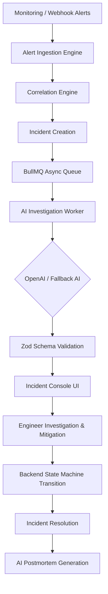

# OpsAI — AI-Powered Incident Intelligence Platform

> **Resolve incidents faster with intelligent investigation.**  
> Production-grade full-stack incident management platform designed for Engineering, SRE, and DevOps teams.

---

## 🚀 Executive Summary & Objective

**OpsAI** transforms traditional DevOps incident management by embedding AI directly into the active investigation workflow. Rather than acting as an isolated chatbot, OpsAI correlates telemetry alerts, calculates severity, extracts confirmed evidence, evaluates operational hypotheses, suggests concrete investigation/mitigation steps, and generates editable postmortem reports—all while maintaining human engineer authority and strict state machine boundaries.



---

## 🛠️ Technology Stack

| Layer | Technologies |
| :--- | :--- |
| **Frontend** | Next.js 14 (App Router), React, TypeScript, Tailwind CSS, Recharts, Socket.IO Client, Lucide Icons |
| **Backend API** | Node.js, Express.js, TypeScript, Mongoose (MongoDB), Socket.IO Server, JWT, bcrypt, Zod |
| **Async Worker** | BullMQ, Redis, OpenAI API (gpt-4o-mini), Zod Schema Parser |
| **Database & Cache** | MongoDB 7.0, Redis 7.2 |
| **DevOps & Containers** | Docker, Docker Compose, Multi-stage Dockerfiles |
| **Testing** | Jest, ts-jest |

---

## 🔑 Key Features

- **Split-Screen Authentication**: Features 1-click Technical Demo Logins for **Engineer** (Vishal), **Incident Manager** (Joshua), and **Admin** (Elena).
- **Executive SRE Dashboard**: Real-time KPI cards (Total, Open, Critical Incidents, MTTR, MTTA, Services at Risk), Recharts frequency trend line chart, severity donut chart, service health matrix, and AI Operations Insight card.
- **Incident Command Console (`/incidents/[id]`)**:
  - **AI Investigation Panel**: Cause, confidence indicator (0-100%), explicit separation of **Confirmed Evidence** vs. **AI Hypotheses**.
  - **Telemetry Anomaly Charts**: Recharts metric visualization (Error rate, Latency, DB connections).
  - **Vertical Incident Timeline**: Chronological events from deployment to resolution.
  - **Correlated Alerts & Deployments**: Automated 10-minute time-window correlation and deployment warning flags.
  - **Similar Incidents**: Similarity scoring against historical resolved incidents.
  - **Collaboration & Notes Feed**: Real-time Socket.IO investigation notes.
  - **In-Context AI Assistant**: Interactive Q&A drawer for instant operational queries.
- **Backend-Enforced State Machine**: Validates transitions (`DETECTED` → `ACKNOWLEDGED` → `INVESTIGATING` → `MITIGATING` → `RESOLVED` → `CLOSED`) preventing illegal status jumps.
- **AI Postmortems**: Automated draft generation with human-in-the-loop review (`"AI Generated — Review Required"`).
- **Immutable Audit Trail**: Cryptographically traceable action log for security compliance.

---

## ⚡ Quick Start & Setup

### Prerequisites
- Node.js v18+ and npm
- Docker and Docker Compose (or local MongoDB + Redis instances)

### 1. Environment Configuration
Copy `.env.example` to `.env`:
```bash
cp .env.example .env
```

### 2. Local Monorepo Installation
```bash
# Install workspace dependencies
npm install

# Build shared package
npm run build:shared
```

### 3. Run with Docker Compose
```bash
docker-compose up --build
```
The application services will be accessible at:
- **Frontend App**: [http://localhost:3000](http://localhost:3000)
- **API Server**: [http://localhost:5000](http://localhost:5000)
- **Health Check**: [http://localhost:5000/health](http://localhost:5000/health)

---

## 🧪 Demo Presentation Flow

1. Open **[http://localhost:3000/login](http://localhost:3000/login)**.
2. Click **`[Login as Engineer]`** (Vishal).
3. Review the **Executive Dashboard**: observe MTTR (42m), MTTA (7m), and the AI Operations Insight card highlighting database pool saturation.
4. Click on featured incident **`INC-2026-0192`** (*Payment API elevated error rate*).
5. Inspect the **AI Investigation Console**:
   - Probable Cause: *Database connection pool exhaustion* (87% confidence).
   - Review **Confirmed Evidence** vs **AI Hypotheses**.
   - Note the deployment warning badge for `payment-api v2.8.4` deployed 2 minutes prior to incident onset.
6. Open **Ask AI Assistant** drawer and select *"Why is this incident SEV-1?"*.
7. Add an investigation note in the collaboration feed.
8. Transition status: `INVESTIGATING` → `MITIGATING`.
9. Click **`Resolve Incident`**, enter root cause (*Connection pool limit scaled 50 → 100*), and submit.
10. Navigate to **Postmortems**, view the AI-generated report, and click **`Publish Postmortem`**.
11. Switch account to **Admin** (Elena) and view **Audit Logs**.

---

## 📡 REST API Reference Summary

| Method | Endpoint | Description | Auth Required |
| :--- | :--- | :--- | :--- |
| `POST` | `/api/auth/login` | Authenticate user & issue JWT | No |
| `POST` | `/api/auth/demo-login` | 1-click role authentication | No |
| `GET` | `/api/incidents` | List incidents with search & filters | Yes |
| `GET` | `/api/incidents/:id` | Get incident details & telemetry | Yes |
| `POST` | `/api/incidents/:id/analyze` | Trigger AI investigation job | Yes |
| `PATCH` | `/api/incidents/:id/status` | Transition status (State Machine) | Yes |
| `POST` | `/api/incidents/:id/resolve` | Resolve incident & update metrics | Yes |
| `POST` | `/api/postmortems/incident/:id/generate` | Generate AI Postmortem draft | Yes |
| `GET` | `/api/analytics/incidents` | Fetch executive MTTR/MTTA metrics | Yes |
| `GET` | `/api/audit-logs` | Fetch immutable system audit trail | Admin |

---

## 🛡️ License

OpsAI is open-source software released under the MIT License.
